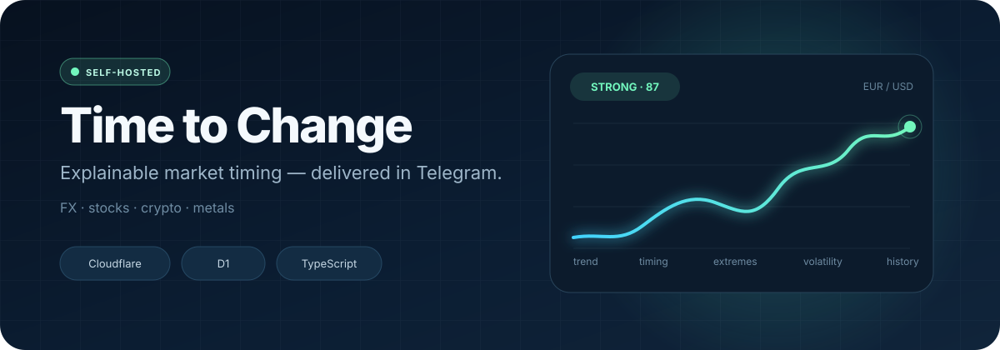
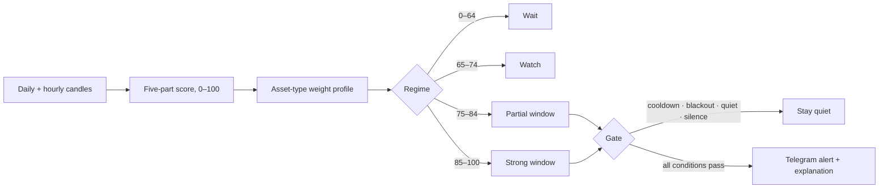
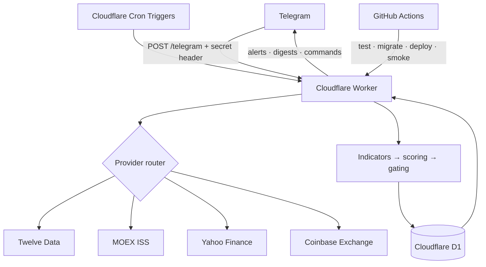

<div align="center">



### It does not guess the price. It helps you decide whether now is a reasonable time to act.

[Русский](./README.md) · [English](./README.en.md)

[](https://github.com/dobrodob/time-to-change/actions/workflows/ci.yml)


[](./LICENSE)

</div>

## What it is

**Time to Change** is a self-hosted Telegram assistant for timing purchases and sales across currencies, stocks, cryptocurrencies, and precious metals.

A regular price bot answers “how much is this asset worth?” This project tackles the more useful question: “how reasonable is it to act now?” It combines daily and hourly candles, produces an explainable 0–100 score, and sends a signal only when several independent conditions line up.

It is not an execution bot. It does not connect to a broker, place orders, or claim to predict the market. It is a personal decision-support system with transparent rules, noise controls, and operator-owned data.

> The source code is public for self-hosting. The author's personal production instance is not a public demo and is not linked from this repository.

## What the bot can do

- Analyzes every active asset hourly through five components: daily trend, hourly timing, extremes, volatility, and historical percentile.
- Uses different weight profiles for forex, stocks, crypto, commodities, and indices.
- Works in both directions: it can look for a reasonable moment to **buy** or **sell**.
- Separates “watch” from actionable partial and strong windows.
- Applies rolling baselines, cooldowns, quiet hours, personal silence, and macro-event blackout windows.
- Supports multiple users with individual subscriptions — up to 10 per user and 15 active instruments per free-tier instance.
- Explains the contribution of each factor through `/explain` instead of exposing only a magic number.
- Maintains alert history, a morning digest, and an EUR → USD conversion budget plan.
- Monitors analysis freshness and API quota, with a daily quota reset.
- Runs without a dedicated server: Telegram webhook + Cloudflare Worker + D1.

## Markets and data sources

| Market | Examples | Provider | Notes |
|---|---|---|---|
| Forex | `EUR/USD`, `GBP/USD` | [Twelve Data](https://twelvedata.com/) | Daily and hourly OHLC candles |
| US equities | `AAPL`, `TSLA`, `NVDA` | Twelve Data | Automatic symbol resolution and classification |
| MOEX equities | `LKOH`, `GAZP`, `SBER` | [MOEX ISS](https://iss.moex.com/iss/reference/) | Free API and market-hours logic |
| Crypto | `BTC/USD`, `ETH/USD` | [Coinbase Exchange](https://docs.cdp.coinbase.com/exchange/docs/welcome) | 24/7 and no Twelve Data credits |
| Precious metals | `XAU/USD`, `XAG/USD` | Yahoo Finance chart API | Gold, silver, platinum, palladium |
| Indices | subject to Twelve Data coverage | Twelve Data | Dedicated scoring weights |

The provider is selected automatically. MOEX, Yahoo, and Coinbase calls share a timeout/retry layer; a failing provider cannot silently turn stale data into a fresh signal.

## How a signal is produced



### The five components

| Component | What it measures | Example indicators |
|---|---|---|
| `trend_daily` | Medium-term direction | EMA20/EMA50, SMA50/SMA200 |
| `timing_hourly` | Intraday entry/exit timing | RSI, MACD histogram, EMA20 |
| `extremes` | Proximity to a local top or bottom | RSI, Bollinger Bands |
| `volatility` | Whether the current regime is usable | Normalized ATR |
| `historical` | Position inside the recent range | 45–60 day percentile rank |

Forex and commodities balance trend with timing; crypto gives more weight to hourly momentum; indices emphasize daily trend. For a `buy` subscription, directional components are mirrored so low price and oversold conditions become positive evidence.

## Telegram commands

| Command | Behavior |
|---|---|
| `/subscribe SYMBOL` | Resolves an asset and asks for buy/sell direction |
| `/unsubscribe SYMBOL` | Removes subscriptions and deactivates orphan assets |
| `/assets` | Lists subscriptions and their latest scores |
| `/status [SYMBOL]` | Shows an overview or one detailed asset |
| `/explain [SYMBOL]` | Breaks the score down into five components |
| `/history` | Shows the latest 10 alerts |
| `/silence [1h\|3d\|2w]` | Pauses notifications; seven days by default |
| `/resume` | Ends silence early |
| `/quiet 23 7` | Sets personal quiet hours |
| `/digest on\|off` | Controls the morning digest |
| `/budget 6000 30d` | Creates an EUR → USD conversion target |
| `/budget done 1500 1.0852` | Records a partial conversion |
| `/undo` | Removes the latest conversion record |
| `/leave` | Removes the current user and subscriptions |

Alerts include inline actions for recording a conversion and muting notifications for one or seven days. With an active budget, the bot also shows the remaining amount, deadline, average rate, and a pacing-aware suggested next step.

## Architecture



The production path lives in [`worker/`](./worker/). The TypeScript Worker receives the authenticated webhook, runs scheduled jobs, and stores users, subscriptions, asset state, and alert history in D1.

The Python code in [`src/`](./src/) is the original reference implementation and local backtesting toolkit. Parity tests protect the mathematical port from Python to TypeScript.

## Quick start

### Prerequisites

- Node.js 24;
- a Cloudflare account with Workers and D1;
- a Telegram bot created through [@BotFather](https://t.me/BotFather);
- a free Twelve Data API key;
- Wrangler CLI, installed with the project dependencies.

### 1. Install and verify

```bash
git clone https://github.com/dobrodob/time-to-change.git
cd time-to-change/worker
npm ci
npm test
npm run typecheck
npm run lint
```

Worker-runtime integration tests run locally and in CI:

```bash
npm run test:integration
```

### 2. Create D1

```bash
npx wrangler login
npx wrangler d1 create euro-dollar-bot-state
```

Paste the resulting `database_id` into [`worker/wrangler.toml`](./worker/wrangler.toml), then apply migrations:

```bash
npx wrangler d1 migrations apply euro-dollar-bot-state --remote
```

### 3. Store secrets

```bash
npx wrangler secret put TELEGRAM_BOT_TOKEN
npx wrangler secret put TELEGRAM_WEBHOOK_SECRET
npx wrangler secret put TWELVEDATA_API_KEY
```

The webhook secret must contain at least 32 random characters. For local development, copy [`worker/.dev.vars.example`](./worker/.dev.vars.example) to `.dev.vars`; the destination is gitignored.

### 4. Deploy and connect Telegram

```bash
cd worker
npx wrangler deploy
```

After deployment, set the Telegram webhook to `<WORKER_URL>/telegram` using the same `TELEGRAM_WEBHOOK_SECRET`. See [worker/README.md](./worker/README.md) for the full command sequence and rollback notes.

## Development and verification

```bash
cd worker
npm run dev              # local Worker on :8787
npm test                 # unit + parity
npm run test:integration # Miniflare D1; Linux/WSL/CI
npm run typecheck        # tsc --noEmit
npm run lint             # Biome
```

To use the legacy backtest toolkit:

```bash
python -m venv .venv
pip install -e ".[dev,backtest]"
python -m src.cli.backtest --months 12
```

## CI/CD and backups

- `ci.yml` verifies both the TypeScript Worker and the Python reference implementation on every pull request and push to `main`.
- `deploy-worker.yml` manually runs the complete Worker gate, migrations, deployment, and a private health check through the protected `production` GitHub Environment.
- `backtest.yml` produces a historical report on demand.
- `d1-backup.yml` exports D1 weekly, encrypts the archive with AES-256-CBC + PBKDF2, and only then uploads the artifact. Enable it with `D1_BACKUP_ENABLED=true`; credentials come from the `production` environment.
- Cloudflare D1 Time Travel provides an additional point-in-time recovery layer; retention depends on the plan.

## Project structure

```text
worker/
  src/
    analyze/       provider routing, indicators, scoring, gating
    commands/      Telegram command handlers and formatters
    digest/        personal morning digest
    monitor/       freshness and quota checks
    state/         D1 repository and Zod schemas
    telegram/      API client, parser and authenticated webhook
  migrations/      versioned D1 schema
  tests/           unit, parity and Miniflare integration tests

src/               Python reference implementation and backtest
tests/             Python regression tests
data/events.json   manually maintained macro-event calendar
docs/              architecture notes and public-facing assets
```

## Security and privacy

- Runtime state, Telegram `chat_id` values, tokens, and API keys are not stored in the repository. `state.json` and `.dev.vars` are gitignored.
- Production data lives in D1; the included state example is empty.
- Telegram requests require the configured secret header, compared without an early exit.
- Secrets are not included in structured logs.
- GitHub Actions uses minimal permissions; a public fork cannot access secrets belonging to the upstream repository.
- Please report vulnerabilities privately according to [`SECURITY.md`](./SECURITY.md).

The current access mode automatically registers anyone who reaches the Telegram bot. Do not publish your live bot username unless you intend to accept outside users; add an allowlist or a stronger authorization model before exposing an instance as a public service.

## Limitations

- The score is a heuristic, not a price forecast or financial advice.
- The bot does not execute trades or know your bank or broker fees.
- The macro-event blackout calendar is maintained manually.
- MOEX logic covers standard trading hours, not every Russian public holiday.
- Twelve Data's free quota limits the practical size of an instance; the code caps it at 15 active assets.
- Telegram copy is currently in Russian and display time uses `Europe/Madrid`.

## Engineering story

The project started as a single-user EUR/USD Python cron bot and evolved into a multi-user serverless product spanning several markets and four data providers. The repository keeps its [architecture decisions](./docs/architecture.md), versioned D1 migrations, and parity fixtures as evidence of that evolution: git-backed JSON state became D1, polling became an authenticated webhook, and one exchange rate became direction-aware subscriptions across asset classes.

## License

[MIT](./LICENSE) © 2026 Konstantin Vorovich.

---

<sub>Built as a decision-support tool. Nothing in this repository is financial advice.</sub>
