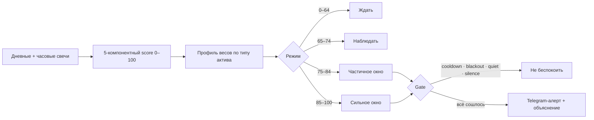
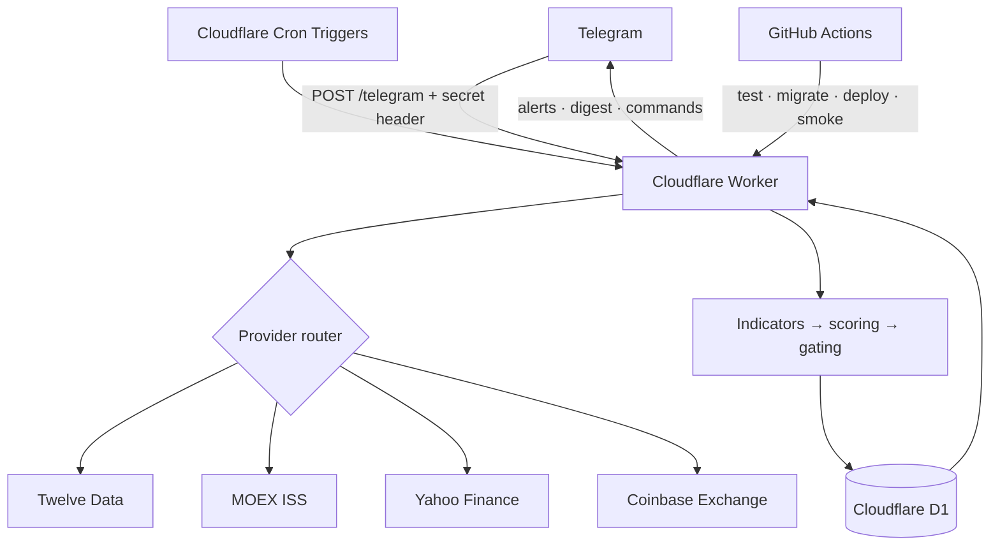

<div align="center">


### Не угадывает цену. Помогает понять, насколько сейчас разумный момент действовать.

[Русский](./README.md) · [English](./README.en.md)

[](https://github.com/dobrodob/time-to-change/actions/workflows/ci.yml)


[](./LICENSE)

</div>

## Что это

**Time to Change** — self-hosted Telegram-ассистент для выбора момента покупки или продажи валют, акций, криптовалют и драгоценных металлов.

Обычный price bot отвечает на вопрос «сколько стоит актив?». Этот проект решает более полезную задачу: берёт дневные и часовые свечи, объяснимо оценивает рыночную ситуацию по шкале 0–100 и присылает сигнал только тогда, когда несколько независимых условий сходятся одновременно.

Это не торговый робот: он не подключается к брокеру, не совершает сделок и не обещает предсказывать рынок. Это персональный инструмент поддержки решений — с прозрачной логикой, ограничителями шума и собственным хранилищем данных.

> Публичен исходный код для самостоятельного развёртывания. Рабочий личный инстанс автора не является публичным демо и не связан из этого репозитория.

## Что умеет бот

- Анализирует каждый актив раз в час по ансамблю из пяти компонентов: дневной тренд, часовой тайминг, экстремумы, волатильность и исторический перцентиль.
- По-разному взвешивает сигналы для forex, акций, криптовалют, сырья и индексов.
- Работает в обе стороны: ищет разумный момент **купить** актив или **продать** его.
- Отделяет «наблюдать» от действительно сильного окна и не тревожит пользователя при слабом сигнале.
- Учитывает rolling baseline, cooldown, тихие часы, персональный silence и blackout вокруг крупных экономических событий.
- Поддерживает несколько пользователей и индивидуальные подписки — до 10 на пользователя и до 15 активных инструментов на один бесплатный инстанс.
- Показывает не только итоговый score, но и вклад каждого фактора через `/explain`.
- Ведёт историю алертов, утренний дайджест и бюджетный план конвертации EUR → USD.
- Сам следит за свежестью анализа, расходом квоты и сбрасывает суточные счётчики.
- Работает без выделенного сервера: Telegram webhook + Cloudflare Worker + D1.

## Рынки и источники данных

| Рынок | Примеры | Источник | Что важно |
|---|---|---|---|
| Forex | `EUR/USD`, `GBP/USD` | [Twelve Data](https://twelvedata.com/) | Дневные и часовые OHLC-свечи |
| Акции США | `AAPL`, `TSLA`, `NVDA` | Twelve Data | Автоматический поиск и классификация тикера |
| Акции MOEX | `LKOH`, `GAZP`, `SBER` | [MOEX ISS](https://iss.moex.com/iss/reference/) | Бесплатный API, собственные market-hours |
| Криптовалюты | `BTC/USD`, `ETH/USD` | [Coinbase Exchange](https://docs.cdp.coinbase.com/exchange/docs/welcome) | 24/7, не расходует квоту Twelve Data |
| Драгметаллы | `XAU/USD`, `XAG/USD` | Yahoo Finance chart API | Золото, серебро, платина, палладий |
| Индексы | зависит от Twelve Data | Twelve Data | Отдельный профиль весов скоринга |

Провайдер выбирается автоматически. Сетевые запросы к MOEX, Yahoo и Coinbase используют общий timeout/retry-контур; падение одного источника не превращает устаревшие данные в свежий сигнал.

## Как рождается сигнал



### Пять компонентов

| Компонент | Что измеряет | Примеры индикаторов |
|---|---|---|
| `trend_daily` | Направление среднесрочного движения | EMA20/EMA50, SMA50/SMA200 |
| `timing_hourly` | Насколько удачен момент внутри дня | RSI, MACD histogram, EMA20 |
| `extremes` | Близость к локальному пику или дну | RSI, Bollinger Bands |
| `volatility` | Насколько режим пригоден для действия | Нормализованный ATR |
| `historical` | Где цена находится в недавнем диапазоне | Percentile rank за 45–60 дней |

Forex и commodity балансируют тренд и тайминг; crypto сильнее опирается на часовой momentum; индексы — на дневной тренд. Для `buy` логика компонентов зеркалится: низкая цена и перепроданность становятся положительным сигналом.

## Команды Telegram

| Команда | Что делает |
|---|---|
| `/subscribe SYMBOL` | Находит актив и предлагает направление buy/sell |
| `/unsubscribe SYMBOL` | Удаляет подписку; orphan-актив перестаёт расходовать квоту |
| `/assets` | Показывает подписки и их текущие оценки |
| `/status [SYMBOL]` | Даёт обзор всех подписок или подробности по одному активу |
| `/explain [SYMBOL]` | Раскладывает score по пяти компонентам |
| `/history` | Показывает последние 10 алертов |
| `/silence [1h\|3d\|2w]` | Временно заглушает уведомления, по умолчанию на 7 дней |
| `/resume` | Снимает silence досрочно |
| `/quiet 23 7` | Включает персональные тихие часы |
| `/digest on\|off` | Управляет утренним дайджестом |
| `/budget 6000 30d` | Ставит цель конвертации EUR → USD |
| `/budget done 1500 1.0852` | Записывает частичную конвертацию |
| `/undo` | Отменяет последнюю запись конвертации |
| `/leave` | Удаляет пользователя и его подписки |

В алерте есть inline-кнопки: отметить конвертацию и заглушить уведомления на 1 или 7 дней. При активном бюджете бот показывает остаток, дедлайн, средний курс и рекомендуемую долю следующего шага.

## Архитектура



Продакшен-путь находится в [`worker/`](./worker/): TypeScript Worker принимает подписанный webhook, запускает cron-задачи и хранит пользователей, подписки, состояние активов и историю в D1.

Python-код в [`src/`](./src/) — исходная reference implementation и локальный backtest toolkit. Parity-тесты защищают перенос математики скоринга из Python в TypeScript.

## Быстрый старт

### Что понадобится

- Node.js 24;
- аккаунт Cloudflare с Workers и D1;
- Telegram-бот от [@BotFather](https://t.me/BotFather);
- бесплатный ключ Twelve Data;
- Wrangler CLI, устанавливается вместе с зависимостями проекта.

### 1. Установить и проверить

```bash
git clone https://github.com/dobrodob/time-to-change.git
cd time-to-change/worker
npm ci
npm test
npm run typecheck
npm run lint
```

Integration-тесты с настоящим Worker runtime запускаются локально и в CI:

```bash
npm run test:integration
```

### 2. Создать D1

```bash
npx wrangler login
npx wrangler d1 create euro-dollar-bot-state
```

Скопируйте выданный `database_id` в [`worker/wrangler.toml`](./worker/wrangler.toml), затем:

```bash
npx wrangler d1 migrations apply euro-dollar-bot-state --remote
```

### 3. Добавить секреты

```bash
npx wrangler secret put TELEGRAM_BOT_TOKEN
npx wrangler secret put TELEGRAM_WEBHOOK_SECRET
npx wrangler secret put TWELVEDATA_API_KEY
```

Webhook secret должен содержать не меньше 32 случайных символов. Для локального запуска скопируйте [`worker/.dev.vars.example`](./worker/.dev.vars.example) в `.dev.vars`; этот файл игнорируется git.

### 4. Задеплоить и подключить Telegram

```bash
cd worker
npx wrangler deploy
```

После deploy установите Telegram webhook на `<WORKER_URL>/telegram` с тем же `TELEGRAM_WEBHOOK_SECRET`. Полный набор команд и rollback-подсказки — в [worker/README.md](./worker/README.md).

## Разработка и проверки

```bash
cd worker
npm run dev              # локальный Worker на :8787
npm test                 # unit + parity
npm run test:integration # Miniflare D1, Linux/WSL/CI
npm run typecheck        # tsc --noEmit
npm run lint             # Biome
```

Для legacy backtest:

```bash
python -m venv .venv
pip install -e ".[dev,backtest]"
python -m src.cli.backtest --months 12
```

## CI/CD и резервирование

- `ci.yml` проверяет TypeScript Worker и Python reference implementation при каждом PR и push в `main`.
- `deploy-worker.yml` вручную запускает полный Worker-gate, миграции, deploy и закрытый health-check через защищённый GitHub Environment `production`.
- `backtest.yml` вручную строит отчёт на исторических данных.
- `d1-backup.yml` еженедельно экспортирует D1, шифрует архив AES-256-CBC + PBKDF2 и только после этого загружает artifact. Он включается переменной `D1_BACKUP_ENABLED=true` и использует secrets из environment `production`.
- Cloudflare D1 Time Travel даёт дополнительное point-in-time recovery; срок зависит от тарифа.

## Структура проекта

```text
worker/
  src/
    analyze/       provider routing, indicators, scoring, gating
    commands/      Telegram command handlers and formatters
    digest/        personal morning digest
    monitor/       freshness and quota checks
    state/         D1 repository and Zod schemas
    telegram/      API client, parser and authenticated webhook
  migrations/      versioned D1 schema
  tests/           unit, parity and Miniflare integration tests

src/               Python reference implementation and backtest
tests/             Python regression tests
data/events.json   manually maintained macro-event calendar
docs/              architecture notes and public-facing assets
```

## Безопасность и приватность

- В репозитории нет runtime-state, Telegram `chat_id`, токенов или API-ключей. `state.json` и `.dev.vars` игнорируются.
- Продовые данные живут в D1. Пример состояния содержит только пустые значения.
- Telegram webhook принимает запросы только с совпадающим secret header и сравнивает его без раннего выхода.
- Ошибки логируются структурированно; значения секретов в логи не пишутся.
- GitHub Actions получает минимальные permissions; публичный fork не может использовать секреты исходного репозитория.
- Уязвимости следует сообщать приватно по правилам [`SECURITY.md`](./SECURITY.md).

Текущий режим доступа автоматически регистрирует пользователя, который нашёл Telegram-бота. Поэтому не публикуйте username своего живого инстанса, если не готовы принимать сторонних пользователей; для публичного сервиса сначала добавьте allowlist или отдельную модель авторизации.

## Ограничения

- Score — эвристическая оценка, а не прогноз цены и не инвестиционная рекомендация.
- Бот не совершает сделки и не знает комиссию конкретного банка или брокера.
- Экономический blackout-календарь поддерживается вручную.
- Календарь MOEX учитывает обычные торговые часы, но не все российские праздники.
- Бесплатная квота Twelve Data ограничивает практический размер одного инстанса; код ставит safety cap в 15 активов.
- Интерфейс Telegram сейчас русскоязычный, display timezone — `Europe/Madrid`.

## Инженерный кейс

Проект начался как однопользовательский EUR/USD cron-бот на Python и вырос в multi-user serverless-продукт с несколькими рынками и четырьмя источниками данных. В репозитории сохранены [архитектурные решения](./docs/architecture.md), versioned D1 migrations и parity fixtures — не как декорация, а как след проверяемой эволюции: от git-backed JSON state к D1, от polling к webhook, от одного курса к направленным подпискам на разные активы.

## Лицензия

[MIT](./LICENSE) © 2026 Konstantin Vorovich.

---

<sub>Built as a decision-support tool. Nothing in this repository is financial advice.</sub>
