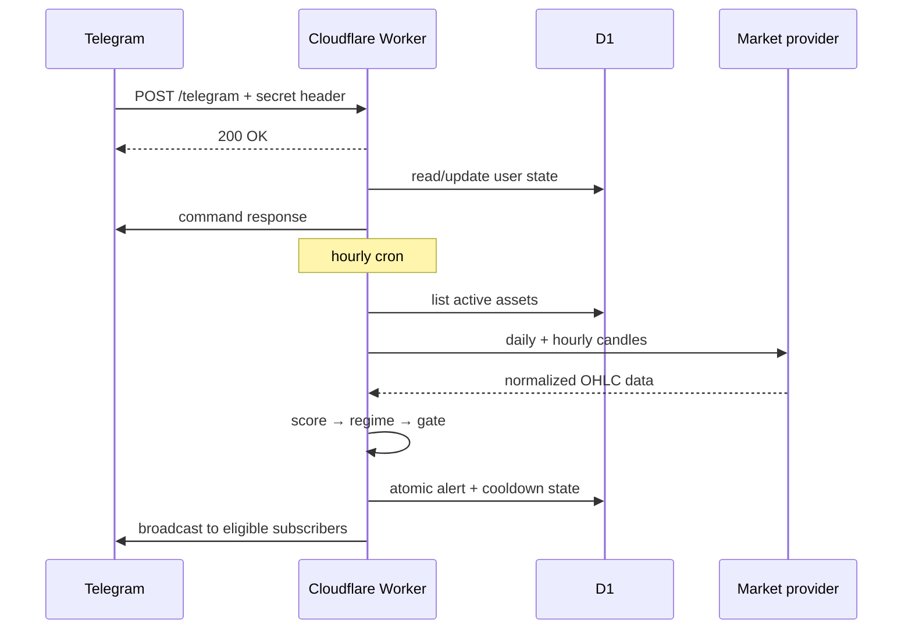

# Architecture

Time to Change is a self-hosted, event-driven Telegram application. This note
captures the durable decisions behind the current implementation; operational
credentials and production-specific identifiers are intentionally absent.

## Design goals

- Answer Telegram commands in seconds rather than on a polling interval.
- Keep the decision model deterministic, explainable, and testable offline.
- Support several market types without coupling the score to one provider.
- Stay within free-tier constraints for a small personal or group instance.
- Keep user state outside git and make every sensitive integration opt-in.
- Fail visibly on stale data without turning provider errors into false signals.

## Runtime

The webhook returns immediately and finishes dispatch through
`ExecutionContext.waitUntil`, preventing Telegram retries from duplicating
normal work.

## Why Cloudflare Workers and D1

The original version used scheduled GitHub Actions and committed a JSON state
file. That was inexpensive but introduced command latency, noisy history, and
state-write contention.

The Worker/D1 design moves both command handling and scheduled analysis into one
runtime:

- webhook latency replaces five-minute polling;
- D1 transactions replace git conflict retries;
- cron triggers no longer consume GitHub Actions minutes;
- state and personal identifiers no longer belong in source control;
- deployment remains small enough for a free personal instance.

## Provider abstraction

Every provider returns the same normalized shape: candles, credit cost, and
resolved symbol metadata. Routing is based on the asset rather than scattered
through the analysis job.

| Asset | Provider | Reason |
|---|---|---|
| Forex, US equities, indices | Twelve Data | Search plus normalized OHLC |
| MOEX equities | MOEX ISS | Native free exchange API |
| Precious metals | Yahoo Finance | Free metal futures candles |
| Crypto | Coinbase Exchange | Reliable 24/7 candles without paid credits |

MOEX, Yahoo, and Coinbase share timeout and retry behavior. Provider errors are
reported as typed failures and do not overwrite the last valid score snapshot.

## Scoring and gating

Scoring is a pure function over normalized candles. Five component scores are
weighted by asset type; direction-aware logic mirrors high-price and low-price
evidence for `sell` and `buy` subscriptions.

Gating is separate from scoring. A high score can still be suppressed by:

- a macro-event blackout;
- a same-or-weaker signal inside the 24-hour cooldown;
- an optional minimum edge threshold;
- per-user silence or quiet hours.

This separation lets tests prove the mathematical score independently from the
notification policy.

## State model

D1 stores:

- users and personal notification settings;
- asset registry and user × asset × direction subscriptions;
- per-asset baselines, separate buy/sell score breakdowns, quota, and directional cooldown state;
- append-only alert history;
- the EUR/USD conversion budget and conversion records;
- macro-event blackout entries.

Multi-statement invariants use `D1Database.batch`. Adding an alert and updating
its cooldown state is atomic. Subscription creation enforces both per-user and
global active-asset limits in the same transaction; orphan deactivation uses a
single conditional statement.

## Verification strategy

- unit tests cover pure scoring, gating, providers, formatters, and error paths;
- Python-generated fixtures verify mathematical parity after the TypeScript port;
- Miniflare integration tests exercise the real Worker + D1 boundary;
- CI runs typecheck, Biome, unit/parity tests, and integration tests before any
  main-branch deployment;
- deploy is followed by an HTTP health smoke, while real operational validation
  still requires observing a scheduled analysis tick.

## Security boundaries

- Telegram webhook requests require a 32+ character secret header.
- Runtime credentials are Worker secrets, never configuration-file values.
- Members cannot read or mutate the owner's conversion budget or enumerate
  other users; alert history is scoped to the requesting user's subscriptions.
- Structured logs remove personal identifiers and raw upstream errors. The
  public health response contains only liveness and analysis freshness.
- The public project does not identify or link the maintainer's live bot.
- D1 backup artifacts are encrypted and verified by a decrypt/list round trip
  before upload.
- A public deployment needs an explicit access-control decision: the current
  application mode auto-registers users who reach the bot.
